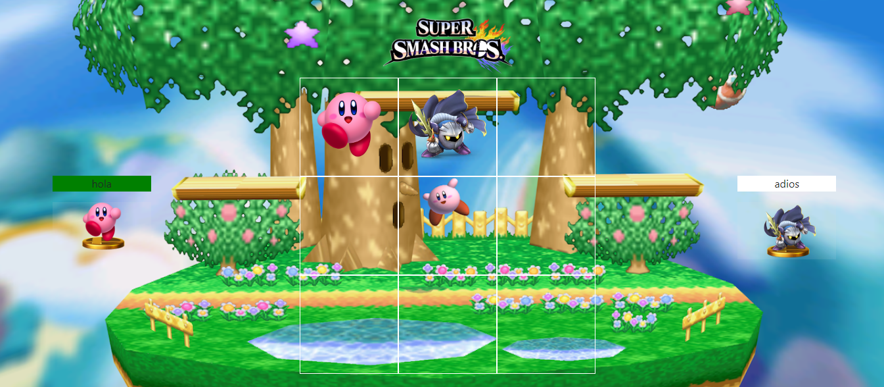
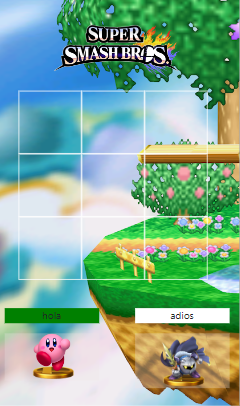

# Welcome to my frontend app

  
Proyecto consola 📝

  <ol>
    <li><a href="#objetivo-🎯">Objetivo</a></li>
    <li><a href="#sobre-el-proyecto-🔎">Sobre el proyecto</a></li>
    <li><a href="#deploy-🚀">Deploy</a></li>
    <li><a href="#stack">Stack</a></li>
    <li><a href="#vistas">Vistas</a></li>
    <li><a href="#licencia">Licencia</a></li>
    <li><a href="#webgrafia">Webgrafia</a></li>
    <li><a href="#agradecimientos">Agradecimientos</a></li>
    <li><a href="#contacto">Contacto</a></li>
  </ol>

## Objetivo 🎯

Este proyecto requiere entregar una web con un juego de tic tac toe.

## Sobre el proyecto 🔎

Decidí crear web de tic tac toe con diseño del juego de smash bros, principalmente en los personages del muundo de kirby.

## Deploy 🚀

    <a href="https://github.com/ZackFer90/ProyectoTicTacToe"><strong>Url a producción </strong></a>🚀🚀🚀

## Stack

 

## Vistas

<h3>Resultado</h3> 
Página inicio

  
Página de tic tac toe

  
Página de victoria 

  

## Licencia

Este proyecto se encuentra bajo licencia de "Mi mismo"

## Webgrafia:

Para conseguir mi objetivo he recopilado información de:

<h3>Html</h3>

- https://getbootstrap.com/docs/5.2/getting-started/rtl/#custom-rtl-values
- https://www.pngwing.com/es/search?q=smash+bros
- https://cybmeta.com/display-none-vs-visibility-hidden-y-tu-como-escondes-las-cosas
- https://paletadecolores.online/colores-html/amarillo/dorado/
- https://developer.mozilla.org/en-US/docs/Web/CSS/transform-function/rotate

<h3>Javascipt</h3>

- https://www.programacionfacil.org/cursos/javascript/capitulo_35_javascript_anadir_modificar_propiedades_objetos.html
- 

## Agradecimientos:

Agradezco a mis compañeros el tiempo dedicado a este proyecto:

- **Fidel**

- **Rodri**

- **Esteven**

- **Adriana**

- **Jose**

- **Yonetzy**

## Contacto

